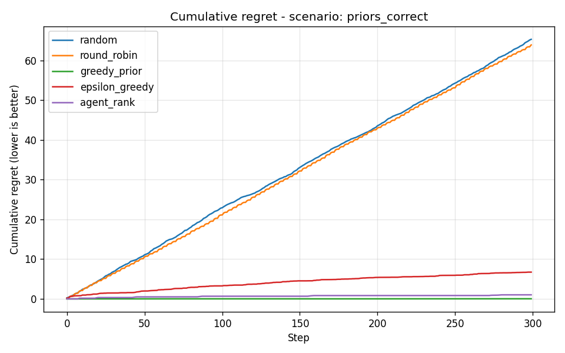
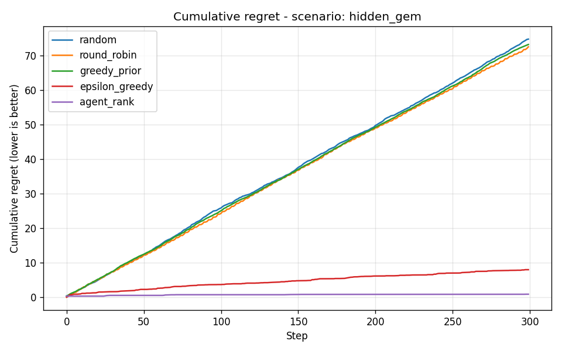
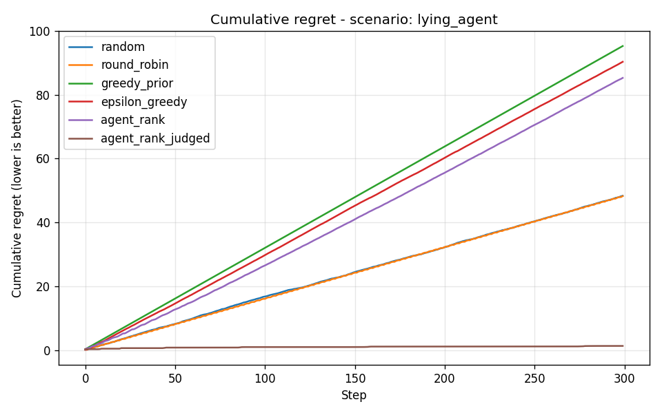
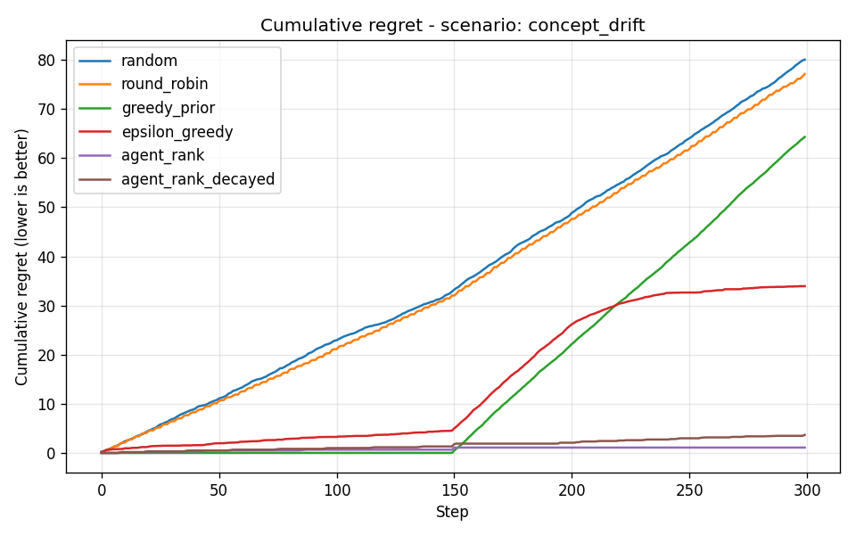
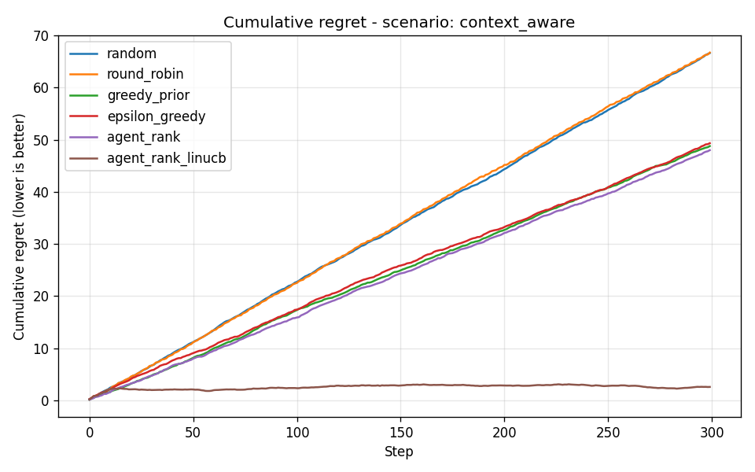
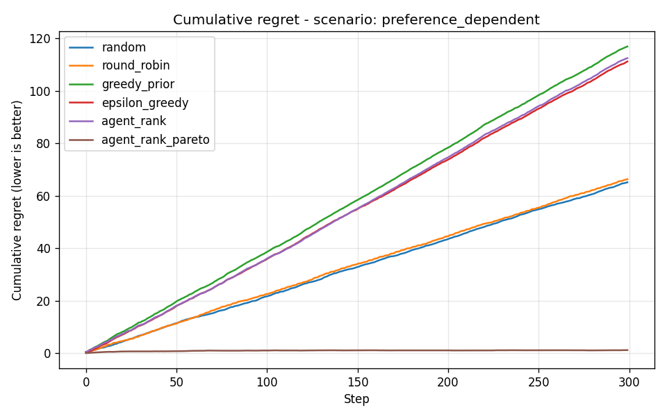
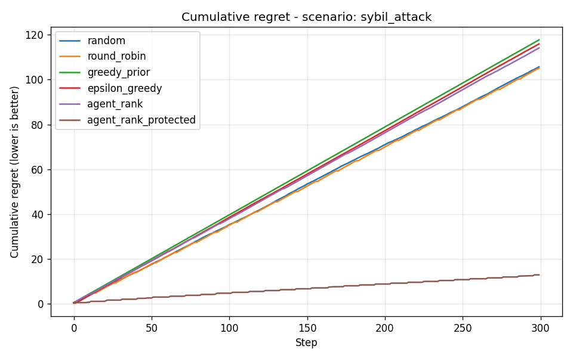

# AgentRank — Intelligent Agent Selection for A2A Ecosystems

> A domain-aware, learning, exploration-enabled ranking engine for multi-agent systems. Replaces "hardcode the best agent" with an adaptive ranker that learns from observed outcomes, resists adversarial agents, adapts to drift, and routes per-request based on payload features.

---

## The problem

The [A2A protocol](https://a2a-protocol.org/) defines how agents talk to each other. It does **not** define which agent to talk to. In any non-trivial deployment you'll have multiple agents that nominally do the same thing — three summarizers, four translators, five recruiters. Picking one is its own problem, and naive answers fail in specific, measurable ways:

| Naive approach | What breaks it |
|---|---|
| Always pick the highest-prior agent | The "best" agent isn't actually best (priors are wrong, or quality changed) |
| Trust the quality each agent self-reports | One agent claims `quality=1.0` and dominates regardless of what it delivers |
| Pick the same agent every time | The best agent today isn't the best agent next month |
| Run one global ranker | Different requests have different optima — a tweet and a legal contract aren't the same task |

AgentRank addresses all four with measurable improvements over baselines. Every claim in this README is reproducible by running `python -m evaluation.run_eval`.

---

## Headline results

Five scenarios from the eval harness, measured by **cumulative regret** vs. an omniscient oracle that always picks the truly best agent. Lower is better. All numbers averaged over 10 trials × 300 steps.

### 1. `priors_correct` — cold-start priors match reality

The "happy path." Greedy wins by a hair because its hardcoded prior happens to be correct. AgentRank pays a small exploration tax. The point of including this scenario: AgentRank isn't catastrophic on easy problems.

| Strategy | Final regret | Selection share |
|---|---:|---|
| **greedy_prior** | **0.03** | SummarizerQuality=100% |
| agent_rank | 1.02 | SummarizerQuality=98%, SummarizerFast=2% |
| epsilon_greedy | 6.73 | SummarizerQuality=93%, others 4% each |
| round_robin | 63.92 | 33% each |
| random | 65.32 | 33% each |



---

### 2. `hidden_gem` — priors are misleading

Cold-start says SummarizerQuality is best. Reality: a "model upgrade" means SummarizerFast is now the optimum. Greedy is stuck on the over-rated agent forever. AgentRank discovers the truth.

| Strategy | Final regret | Selection share |
|---|---:|---|
| **agent_rank** | **0.86** | SummarizerFast=99% (correct) |
| epsilon_greedy | 7.98 | SummarizerFast=93% |
| round_robin | 72.61 | 33% each |
| greedy_prior | 73.28 | SummarizerQuality=100% (stuck on stale prior) |
| random | 74.84 | 33% each |



Same `greedy_prior` strategy that won scenario 1 is catastrophic here. AgentRank is the only strategy robust to whether priors are correct.

---

### 3. `lying_agent` — agent self-reports are corruptible

`SummarizerLiar` self-reports `quality=0.95` on every call but actually delivers `0.20`. Strategies that learn from observed (claimed) quality get fooled and converge on the lie. The judged variant uses an external `QualityJudge` and sees through it.

| Strategy | Final regret | Selection share |
|---|---:|---|
| **agent_rank_judged** | **1.34** | SummarizerQuality=98% (sees the lie) |
| round_robin | 48.26 | 33% each |
| random | 48.36 | 33% each |
| agent_rank | 85.28 | **SummarizerLiar=89%** (fooled) |
| epsilon_greedy | 90.33 | **SummarizerLiar=93%** (fooled) |
| greedy_prior | 95.26 | **SummarizerLiar=100%** (fooled) |



**The smarter the learning algorithm, the worse it does** when quality can be lied about — because smart learners actively converge on the lie. Random and round-robin do better here than AgentRank-without-judge, simply by accident. Only the judged variant gets near-zero regret. This is the strongest motivation for LLM-as-judge in agent marketplaces.

---

### 4. `concept_drift` — agent quality changes mid-trial

For the first 150 calls, SummarizerQuality is best. After step 150 it silently degrades while SummarizerFast improves. The oracle's identity flips. AgentRank adapts; greedy doesn't.

| Strategy | Final regret | Selection share |
|---|---:|---|
| **agent_rank** | **1.10** | SF=51%, SQ=49% (adapted) |
| agent_rank_decayed | 3.68 | SF=51%, SQ=49% |
| epsilon_greedy | 33.94 | SQ-heavy |
| greedy_prior | 64.29 | SummarizerQuality=100% (stuck) |
| round_robin | 77.10 | 33% each |
| random | 80.03 | 33% each |



Both AgentRank variants adapt because the drift is dramatic (quality changes by ~0.6) and UCB's continuous exploration is sufficient on its own. The decay variant's value would dominate in longer-horizon scenarios with subtler drift, where the bandit has "settled" and natural exploration isn't enough — the mechanism is in place for those cases.

---

### 5. `context_aware` — the best agent depends on the request

SummarizerFast is great on short text, terrible on long. SummarizerQuality is the inverse. **There is no single best agent on average.** UCB1 is fundamentally limited because it can only learn one preference per agent. LinUCB learns a per-agent reward function over payload features and routes each request to the right agent.

| Strategy | Final regret | Selection share |
|---|---:|---|
| **agent_rank_linucb** | **2.60** | SF=45%, SQ=54% (routes by context) |
| agent_rank | 47.99 | SF=51%, SQ=48% (random tie) |
| greedy_prior | 48.78 | SQ=100% |
| epsilon_greedy | 49.33 | SF=60% |
| random | 66.61 | 33% each |
| round_robin | 66.70 | 33% each |



**LinUCB drops regret 18× vs UCB1.** No amount of tuning UCB1's exploration can recover this — the optimum requires conditioning on request features, and UCB1 doesn't have that capability.

---

### 6. `preference_dependent` — different requests want different tradeoffs

Three agents with very different cost / quality / latency profiles (premium-slow-expensive, balanced, budget-fast-cheap). Each request carries its own preference vector — quality-first, latency-first, or cost-first. **No single agent serves all three preferences.** UCB1 picks one global winner and pays linear regret on the other ~66% of requests. ParetoBandit reads per-request preferences and routes accordingly.

| Strategy | Final regret | Selection share |
|---|---:|---|
| **agent_rank_pareto** | **1.12** | BudgetFast=64%, PremiumSlow=33% (routes by preference) |
| random | 65.16 | 33% each |
| round_robin | 66.33 | 33% each |
| epsilon_greedy | 111.25 | PremiumSlow=93% (one global winner) |
| agent_rank | 112.52 | PremiumSlow=92% |
| greedy_prior | 116.98 | PremiumSlow=100% |



**ParetoBandit drops regret 100× vs UCB1.** When the caller's tradeoff varies per request, a fixed scoring formula is structurally incapable of optimizing — the answer requires reading the per-request preferences.

---

### 7. `sybil_attack` — an attacker floods the registry with fake agents

An attacker spawns 10 fresh agents with inflated cold-start priors (claimed quality 0.99, actually 0.05). They also self-report perfect quality on every call, so without a judge the bandit has no signal to learn from observed metrics alone. Without protection, UCB1 wastes exploration on each, greedy locks onto the highest-prior sybil, and the system collapses. With probation + anomaly detection, sybils are bounded.

| Strategy | Final regret | Selection share |
|---|---:|---|
| **agent_rank_protected** | **12.79** | SQ=88%, sybils capped at 10% combined |
| round_robin | 105.02 | spread evenly across 13 agents |
| random | 105.72 | spread evenly across 13 agents |
| agent_rank | 114.17 | each sybil ~10%, real agents starved |
| epsilon_greedy | 115.96 | sybils dominate |
| greedy_prior | 117.76 | **SybilAgent_00=100%** (top prior wins) |



**Protected variant drops regret 9× vs unprotected AgentRank.** The probation policy caps non-allowlisted agents at 10% collective exposure; the inflated-claim anomaly detector flags sybils whose claimed-quality is suspiciously uniform-and-high (≥0.95 with ~zero variance). Honest agents that consistently deliver e.g. 0.9 are not flagged — the threshold is calibrated to catch saturation, not consistency.

---

## What this proves

Pick any scenario above and try a baseline. Each baseline that wins one scenario loses catastrophically on another:

- `greedy_prior` wins #1, loses badly on #2, #3, #5, #6, #7
- `agent_rank` (UCB1) wins #2 and #4, loses badly on #3, #5, #6, #7
- `random` is mediocre everywhere

Only **AgentRank with the right policy plug-ins** stays near oracle across all scenarios:

| Scenario | Best AgentRank variant | Regret vs oracle |
|---|---|---:|
| priors_correct | `agent_rank` (UCB1) | 1.02 |
| hidden_gem | `agent_rank` (UCB1) | 0.86 |
| lying_agent | `agent_rank_judged` | 1.34 |
| concept_drift | `agent_rank` (UCB1 with built-in exploration) | 1.10 |
| context_aware | `agent_rank_linucb` | 2.60 |
| preference_dependent | `agent_rank_pareto` | 1.12 |
| sybil_attack | `agent_rank_protected` | 12.79 |

That's the entire pitch: **one consistent framework with pluggable bandit policies, an external quality signal, multi-objective routing, and trust controls — robust to every failure mode a real multi-agent ecosystem will throw at it.**

---

## Quick start

```bash
# clone
git clone <repo-url>
cd agentrank-a2a

# install dependencies (numpy is required for LinUCB; matplotlib is
# optional, only used to render regret plots).
pip install -r requirements.txt

# run the interactive demo: prompts you for text, ranks the summarizers,
# dispatches via the A2A protocol layer, judges the output, and logs
# the metrics for future rankings.
python run_demo.py

# non-interactive smoke test: 15 requests through the full pipeline,
# prints the ranking and selection share.
python scripts/smoke_test.py

# run the full evaluation suite: 5 strategies × 7 scenarios × 10 trials,
# writes JSON + matplotlib plots into evaluation/results/.
python -m evaluation.run_eval

# longer / more careful run
python -m evaluation.run_eval --steps 1000 --trials 20

# run the test suite (70 tests, ~7s)
python -m pytest tests/
```

`run_demo.py` will auto-pick the AnthropicJudge if `ANTHROPIC_API_KEY` is set in your environment, otherwise it uses the offline `MockHeuristicJudge`.

---

## Status

| # | Stage | Status | What it gives you |
|---|---|---|---|
| 1 | Foundation (UCB1 + config + SQLite) | ✅ | Per-domain config, exploration, persistent logs |
| – | Evaluation harness | ✅ | 5 baseline strategies, 7 scenarios, regret/share plots |
| 2 | LLM-as-judge quality signal | ✅ | Catches lying agents (heuristic / oracle / Anthropic stub) |
| 3 | Concept drift via exponential decay | ✅ | Adapts to agent behavior changing over time |
| 4 | Contextual bandit (LinUCB) | ✅ | Per-request routing by payload features |
| 5 | Multi-objective Pareto scoring | ✅ | Per-request user preference vectors |
| 6 | Trust / sybil resistance | ✅ | Allowlist + probation + anomaly detection |

The **AnthropicJudge** is wired but ungated until `ANTHROPIC_API_KEY` is supplied. Signed-identity attestation and per-agent rate limits (Stage 6 design) are documented in [`docs/ARCHITECTURE.md`](docs/ARCHITECTURE.md) but not implemented — they require multi-process infrastructure outside the scope of a single-process eval. The rest of the system works fully offline.

---

## Architecture

```
                  ┌─────────────────────┐
                  │    config/*.json    │ scoring weights, priors,
                  │  (data-driven)      │ bandit choice, drift, registry
                  └──────────┬──────────┘
                             │
                  ┌──────────▼──────────┐
                  │   ScoringConfig     │  (config_loader.py)
                  └──────────┬──────────┘
                             │
   ┌──────────┐   ┌──────────▼──────────┐   ┌──────────────────┐
   │ Domain   │──▶│  AgentRankService   │◀──│ FeatureExtractor │
   │ Registry │   │                     │   │  (length_bucket) │
   └──────────┘   └──┬──────────────┬───┘   └──────────────────┘
                     │              │
                     ▼              ▼
              ┌──────────┐   ┌──────────┐
              │ Bandit   │   │ LogStore │  (SQLite, JSON-encoded
              │ Policy   │   │          │   feature vectors)
              │ (UCB1 /  │   └────▲─────┘
              │ LinUCB)  │        │
              └──────────┘        │
                     │            │
                     ▼            │
              ┌──────────┐        │
              │  Best    │        │ outcome metrics
              │  Agent   │────────┤ (incl. judge score
              └──────────┘        │  if configured)
                     │            │
                     ▼            │
              ┌──────────┐  ┌─────┴─────┐
              │ A2A send │─▶│  Judge    │
              └──────────┘  │ (mock /   │
                            │  oracle / │
                            │ Anthropic)│
                            └───────────┘
```

Three things make this work:

1. **All scoring is data-driven.** Weights, exploration α, drift half-life, bandit kind, feature extractor — every knob lives in `config/scoring.json`. No code change required to tune.
2. **Pluggable bandit policies.** `bandits.py` defines a `BanditPolicy` ABC. `UCB1Bandit` covers the context-blind case (with optional concept-drift decay). `LinUCBBandit` plugs in for contextual scenarios. Adding new policies (Thompson sampling, neural bandits) is local to that file.
3. **Quality is verified, not trusted.** The optional `QualityJudge` re-scores the agent's output and overrides the agent's self-report. Without this, every learning strategy in the system is gameable.

See [`docs/ARCHITECTURE.md`](docs/ARCHITECTURE.md) for the full design and per-component walkthrough.

---

## Project structure

```
agentrank-a2a/
├── config/scoring.json        # all scoring knobs
├── config_loader.py           # ScoringConfig + with_priors/with_registry/with_bandit
├── bandits.py                 # BanditPolicy ABC, UCB1, LinUCB, factory
├── feature_extractor.py       # PayloadFeatureExtractor + LengthBucketExtractor
├── judge.py                   # QualityJudge: Mock, Oracle, Anthropic
├── log_store.py               # SQLite invocation log (auto-migrating schema)
├── domain_registry.py         # (domain, task_type) → [agent_id]
├── agent_rank_service.py      # ranking entry point (delegates to bandit)
├── agent_client.py            # rank → dispatch → judge → log
├── a2a_protocol.py            # toy A2A message-passing layer
├── agents/                    # SummarizerFast / Quality / Hallucinator
│
├── evaluation/                # reproducible eval harness
│   ├── simulator.py           # TruthSpec — context-aware synthetic agents
│   ├── strategies.py          # Random, RoundRobin, GreedyPrior, EpsilonGreedy, AgentRank
│   ├── scenarios.py           # 5 scenarios isolating each failure mode
│   ├── runner.py              # one-trial executor
│   ├── metrics.py             # regret, selection share
│   └── run_eval.py            # CLI entry — writes JSON + PNG to results/
│
├── scripts/smoke_test.py      # 15-request non-interactive demo
├── run_demo.py                # interactive demo with judge wired in
│
├── tests/                     # pytest sanity + integration suite (~7s)
│   ├── test_pareto.py         # frontier math, weighted pick, normalize
│   ├── test_log_store.py      # decay arithmetic, cost score, cold start
│   ├── test_trust.py          # allowlist, share cap, anomaly detector
│   ├── test_config.py         # default-fill, composers, agent priors
│   ├── test_bandits.py        # UCB1, LinUCB warm-start + routing, Pareto
│   └── test_scenarios_integration.py   # every documented winner still wins
│
└── docs/
    ├── ARCHITECTURE.md        # detailed component design
    ├── EVAL.md                # running and interpreting evals
    └── images/                # regret plots referenced from this README
```

---

## How the scoring works

For UCB1 (the default):

```
score(a) = base(a) + exploration(a)

base(a)        = w_SR · success_rate(a)
               + w_QS · quality_score(a)
               + w_LS · latency_score(a)
               + w_FR · failure_rate(a)

exploration(a) = α · √( ln(1 + N) / (1 + n_a) )
```

With concept-drift decay enabled (`half_life_calls` set in config), both the base metrics and the counts use exponentially-weighted aggregates:

```
weight(entry_i) = 0.5 ^ ((current_tick − entry_i.id) / half_life_calls)
```

For LinUCB (contextual):

```
A_a   = ridge · I + Σ_t  x_t x_tᵀ        (sum over a's logged calls)
b_a   = Σ_t  r_t · x_t                   (r_t is the same per-call reward)
θ_a   = A_a⁻¹ b_a
score(a, x) = θ_aᵀ x + α · √( xᵀ A_a⁻¹ x )
```

Where `x` is the payload's feature vector from `feature_extractor.LengthBucketExtractor`. Cold-start warm-up forces each agent to be tried `warm_start_n` times before LinUCB takes over, so the per-context fit has something to learn from.

When a `QualityJudge` is configured on the `AgentClient`, the agent's self-reported `quality_score` is replaced by the judge's verdict before logging — so the bandit learns from verified quality, not from agent self-reports.

See [`docs/ARCHITECTURE.md`](docs/ARCHITECTURE.md) for derivations and design notes.

---

## Reproducing the headline results

```bash
python -m evaluation.run_eval --steps 300 --trials 10
```

Output goes to `evaluation/results/`:
- `summary.json` — per-scenario, per-strategy regret means/stdevs and selection share
- `regret_curves.json` — full averaged regret curves for custom plotting
- `regret_<scenario>.png` — the plots embedded above

To rerun with a longer horizon:

```bash
python -m evaluation.run_eval --steps 2000 --trials 20
```

See [`docs/EVAL.md`](docs/EVAL.md) for how to interpret the output, how to add new scenarios, and how to swap in different bandit policies.

---

## Roadmap

All seven planned stages are implemented and validated. Future work:

- **Signed-identity attestation** (deferred from Stage 6) — ed25519
  keypairs per agent, signature verification on log submission, an
  out-of-band identity registry. Requires multi-process infrastructure
  that doesn't fit the single-process eval but is the missing piece
  for real-world deployment.
- **Per-agent rate limiting** — caps on log submissions per minute
  per agent. Same multi-process caveat.
- **Real-LLM agents in the eval** — current synthetic agents are
  parametric. The `Strategy` interface is plug-compatible with the
  real `AgentClient`, so swapping in API-backed summarizers is
  mechanical, just expensive.
- **Richer feature extractors** — `LengthBucketExtractor` has 4 dims.
  An embedding-based extractor would unlock content-aware routing
  (e.g., "legal text → SummarizerLegal, casual text → SummarizerCasual").
- **Constrained Pareto queries** — current ParetoBandit treats
  preferences as a scoring direction. The natural extension is "min
  cost subject to quality ≥ 0.7" — a constrained optimization over
  the frontier.

See [`docs/EVAL.md`](docs/EVAL.md) for how to add new scenarios that
prove a new mechanism's value, and [`docs/ARCHITECTURE.md`](docs/ARCHITECTURE.md)
for where each future piece would plug in.
